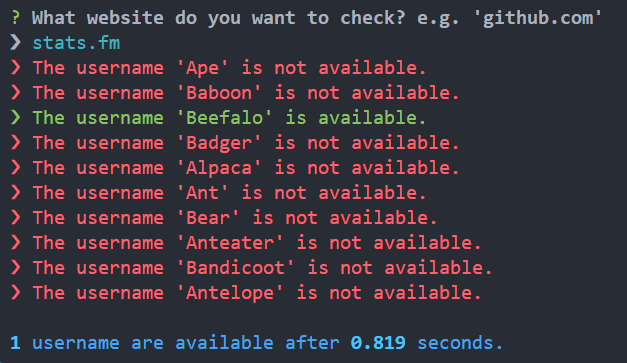

# Username Checker

A lightweight, performant node.js app to bulk check the availablility of usernames of a specified website.

## Prerequisites

-   Have node.js and npm [installed](https://nodejs.org/en/download)

## Installation from release

1. Download the zip of the latest release
2. Unzip the contents to their own folder and navigate to said folder
3. Install the dependencies with one of the following commands

```bash
npm install
yarn install
pnpm install (recommended)
```

## Usage with release files

1. Put the list of usernames you want to check in `usernames.txt`, formatted with a new username on a new line. **Find inspiration [here](https://github.com/zurlyy/word-list).**

2. Run the script with the following commands:

```bash
node index.js
```

3. Allow the app to run, after which a list of available usernames will appear in `available_usernames.txt`

## Example output



## Installation from source

1. Clone the repository or download the zip (not from releases)
2. Navigate to the app's folder and install the dependencies with one of the following commands

```bash
npm install
yarn install
pnpm install (recommended)
```

## Usage with source files

1. Put the list of usernames you want to check in `usernames.txt`, formatted with a new username on a new line. **Find inspiration [here](https://github.com/zurlyy/word-list).**

2. If you want to run in a development environment (nodemon) run the following command:

```bash
npm run dev
yarn run dev
pnpm run dev (recommended)
```

Otherwise if you want to build and then run the build javascript run:

```bash
npm run build && npm run prod
yarn run build && yarn run prod
pnpm run build && pnpm run prod (recommended)
```

3. Allow the app to run, after which a list of available usernames will appear in `available_usernames.txt`

## Limitations

-   Please be aware that some sites prevent this method of checking names. Consequently, the effectiveness of this approach may be limited in such cases.
-   Additionally, it is important to note that usernames that are considered "banned" may erroneously appear as available, despite being unavailable.
